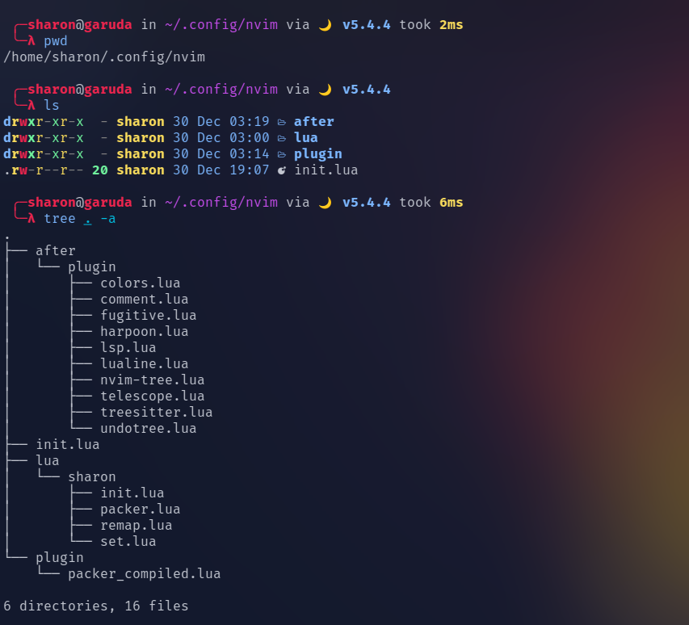

# File Structure

This is the file structure tree:



inside the `.config` folder create `nvim` folder to **configure neovim**

## The nvim Folder

create the following inside the nvim folder:

-  `init.lua` (file)

-  `lua` (folder)

-  `after` (folder)

---

## Quick Tree Explanation

`after/plugin` will run after the init.lua (the one in the nvim folder), and contains all of my plugin setup.

`plugin` this folder will be automatically created by [packer](https://github.com/wbthomason/packer.nvim) if you decided to use it as your neovim package manager

`lua/sharon` you can name this folder whatever you want but this folder will contain alot of important stuff

-  First `init.lua` (the one in the sharon folder)

we'll use this one to require the other files

```lua
require("sharon.remap")
require("sharon.set")
```

-  Second `packer.lua`

we'll use this one to add plugins (you don't need to require this file)

```lua
vim.cmd [[packadd packer.nvim]]
return require('packer').startup(function(use)
    -- put your plugins here
    -- Example:
    use ('wbthomason/packer.nvim')
end)
```

-  Third `remap.lua`

we'll use this file to set our keybindings

use the following command:

```lua
-- we have 3 modes in vim: normal, insert, visual
-- you can make keybindings relative to the mode the user in
-- vim.keymap.set("the mode", "the keys", "the action")
-- the first parameter can take "n", "i", "v"
vim.keymap.set("n", "<leader>ff", "<cmd>Telescope find_files<cr>")
```

-  Fourth `set.lua`

we can set some commands to run on the startup of neovim

```lua
-- indentation
opt.tabstop = 4
opt.softtabstop = 4
opt.shiftwidth = 4
opt.expandtab = true

-- appearance
opt.termguicolors = true
opt.signcolumn = "yes"
opt.background = "dark"
```

---

I recommend that you check out the following sources to configure your neovim:

-  [Learn Neovim The Practical Way](https://alpha1phi.medium.com/learn-neovim-the-practical-way-8818fcf4830f#545a)

-  [The GOAT himself](https://www.youtube.com/watch?v=w7i4amO_zaE)
